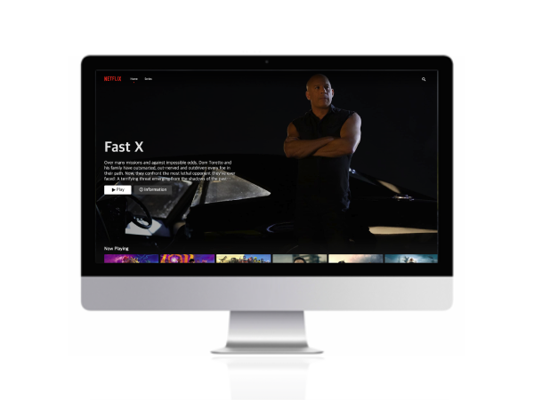
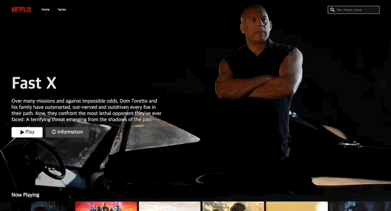
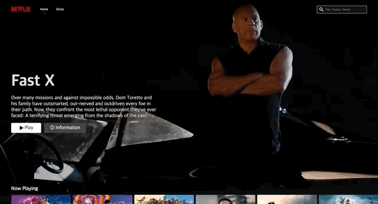

# Netflix Clone
 

 
<a display="block" href="https://byul-netflix-clone.netlify.app/">https://byul-netflix-clone.netlify.app/</a>
  

 

## 화면구성 🖥

 

## Stacks 🧑🏻‍💻
### Environment

### Config
        
### Development
 

 
 
 
### Style
 

### Configuration Management & Deploy

    
 

## Project Detail 💻
### 1. 영화, 드라마 정보 제공
- React Query를 이용한 영화, 드라마 정보 API연동.

 

### 2. Slider 구현
- Framer Motion을 이용한 Slider 구현.

 

### 3. 영화, 드라마 상세 정보 제공을 위한 Modal창
- Framer Motion을 이용한 Modal창 구현.

 

### 4. 검색기능
- React Query를 이용한 검색 정보 API연동.
- React Hook Form을 이용한 검색어 유효성 검사.

 

